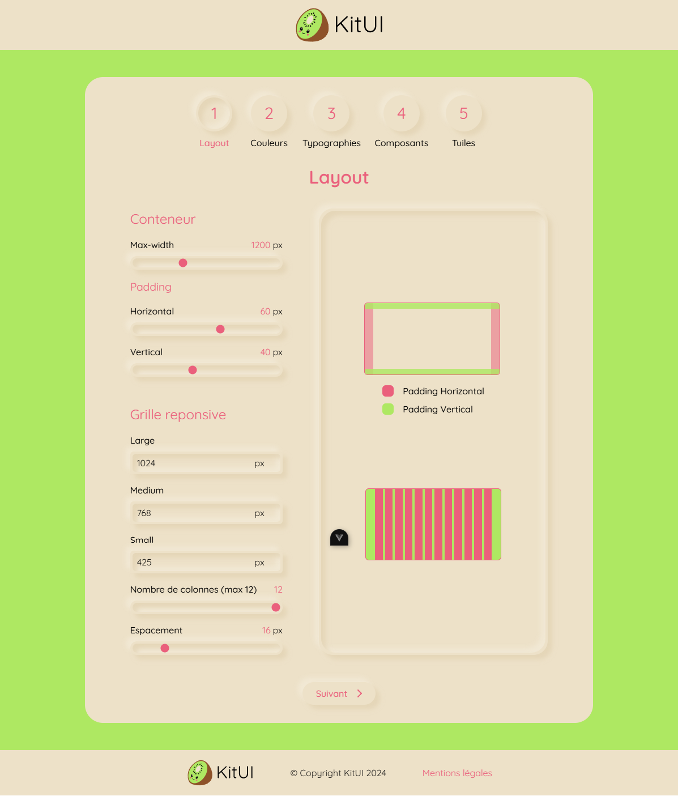
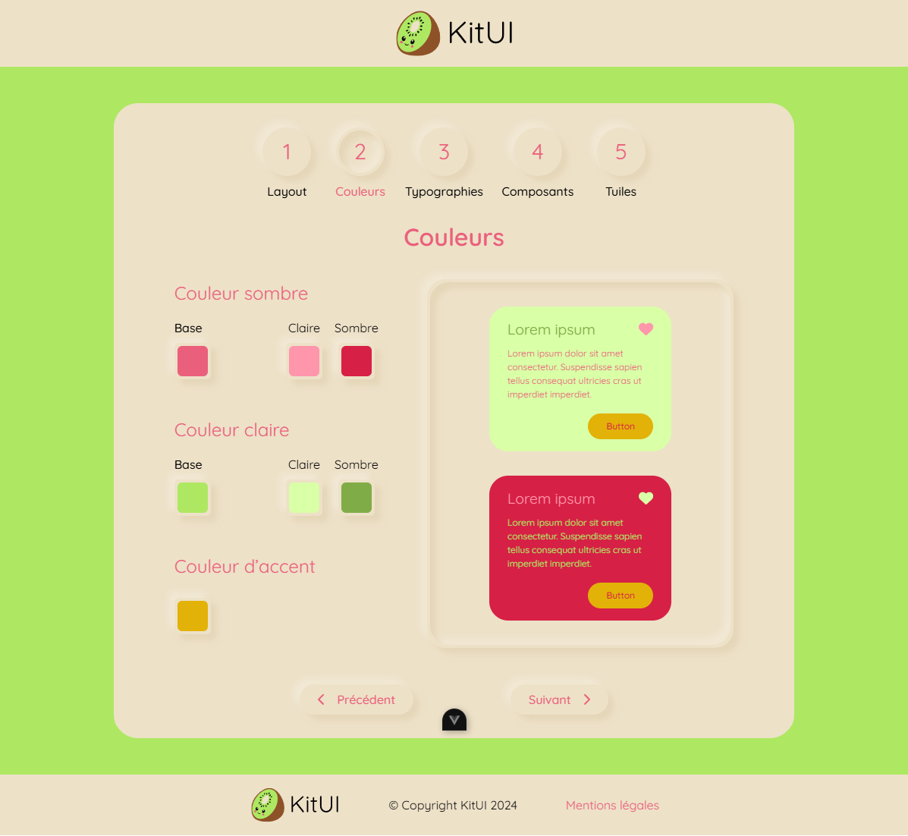
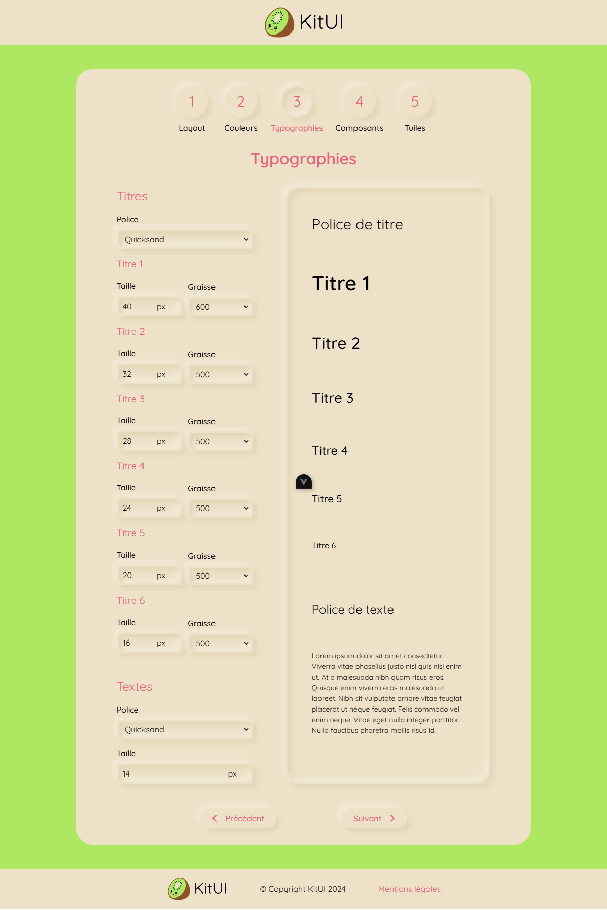
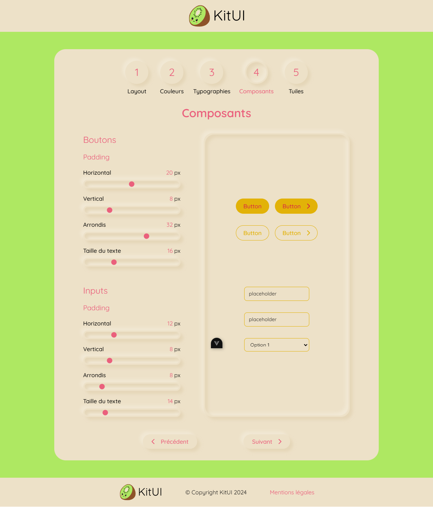
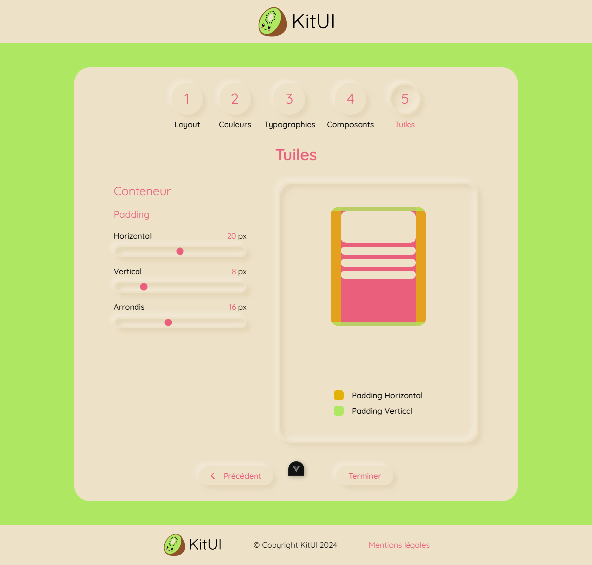
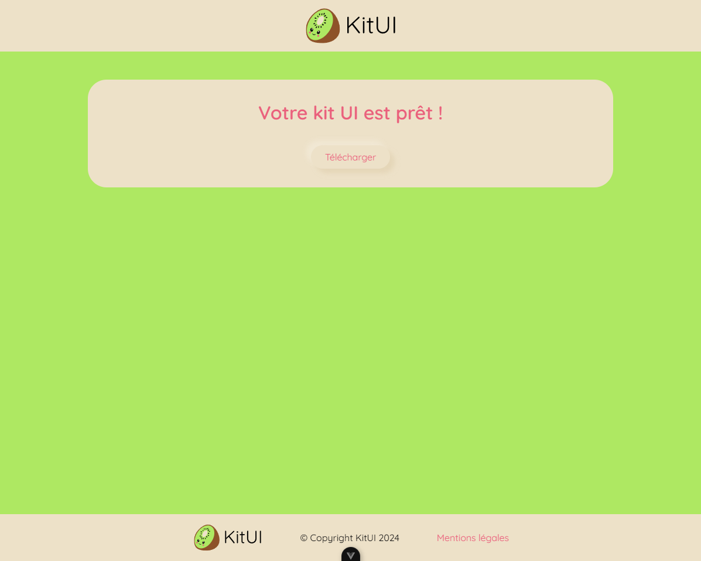

# KitUI

**KitUI** est un outil basé sur **Vue.js** permettant de créer un kit UI sur mesure. Il génère un fichier CSS dynamique à l'aide d'une API développée en **Node.js**.

---

## Mise en place du projet

Le projet **KitUI** est structuré en deux parties principales : le **backend** (`back`) et le **frontend** (`front`). Voici les étapes pour configurer et lancer chaque partie.

### Backend

1. Accédez au répertoire `back` :

   ```bash
   cd back
    ```

2. Installez les dépendances :

   ```bash
   npm install
   ```

3. Lancez le serveur :  

   ```bash
    npm run dev
    ```

### Frontend

1. Accédez au répertoire `front` :

   ```bash
   cd front
    ```

2. Installez les dépendances :

    ```bash
    npm install
    ```

3. Lancez le serveur en mode développement :

    ```bash
    npm run dev
    ```

---

## Accès au projet

Le projet est accessible via l'adresse suivante :

👉 [http://localhost:5173](http://localhost:5173)

---

## Aperçu du projet

### Page d'accueil


---

### Page de création de Kit UI

#### Section Layout



#### Section Couleurs



#### Section Typographies



#### Section Composants



#### Section Tuiles



---

### Page de téléchargement


